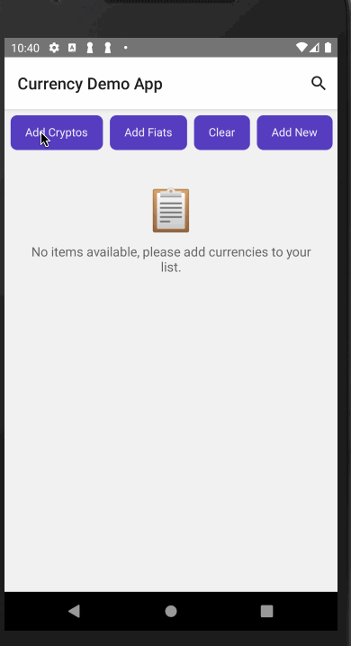
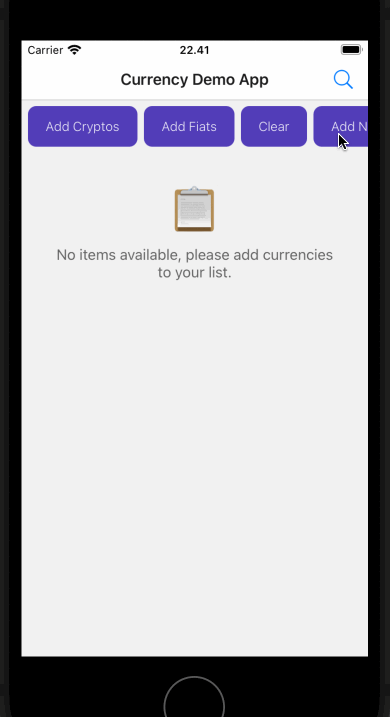

# [React Native] Currency Demo

## Requirements
* Git
* NodeJS 23.6.0
* React Native 0.79.2
* Android Studio Meerkat + Android SDK (including JDK 17) for Android
* XCode 16.1 beta 3 for iOS

## Highlighted Packages
* [React Navigation](https://reactnavigation.org/) - Navigation library
* [Zustand](https://zustand-demo.pmnd.rs/) - State management
* [i18next](https://www.i18next.com/) - Internationalization framework
* [React Hook Form](https://react-hook-form.com/) - Form validation
* [Tamagui](https://tamagui.dev/) - UI kit for React Native
* [Jest](https://jestjs.io/) - JavaScript testing framework

## How to Run (Local)

### Android
```bash
# Install dependencies
npm install

# Start Metro bundler
npx react-native start

# Run on Android device/emulator
npx react-native run-android
```

### iOS
```bash
# Install dependencies
npm install

# Install CocoaPods dependencies
cd ios && pod install && cd ..

# Start Metro bundler
npx react-native start

# Run on iOS simulator
npx react-native run-ios
```

### Run Unit Test
You can run the test using `npm run test`


### Troubleshooting
If you encounter any issues:
- Make sure all required dependencies are installed
- Clean and rebuild the project:
    ```bash
    # For Android
    cd android && ./gradlew clean && cd ..
    
    # For iOS
    cd ios && pod deintegrate && pod install && cd ..
    ```
  
- For more detailed troubleshooting, check the [React Native documentation](https://reactnative.dev/docs/troubleshooting)

## Demo
| Android | iOS |
|---------|-----|
|  |  |

